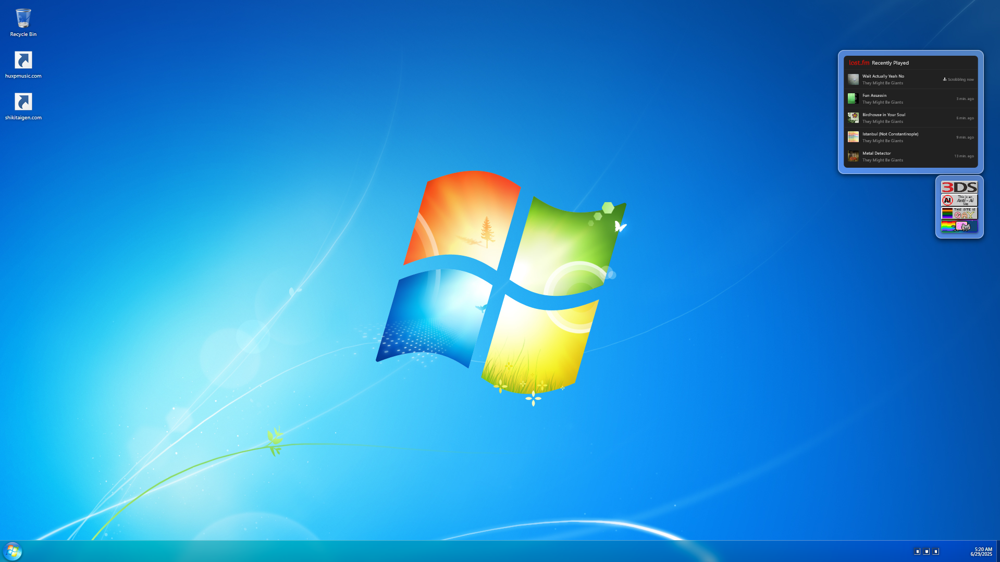

# MitchBentz.com  
*A playful Windows 7-themed personal homepage for Mitch "Michelle" Bentz*

---

## What is this?

**MitchBentz.com** is a single–page website that recreates the nostalgic look-and-feel of Windows 7:
 
* Start menu with avatar, links, search box and shut-down button  
* Re-positionable "gadget" widgets
* Desktop shortcuts to external projects (HuxP, Shiki Taigen Blog)  
* Live system clock, Peek "Show Desktop" button and tray icons
